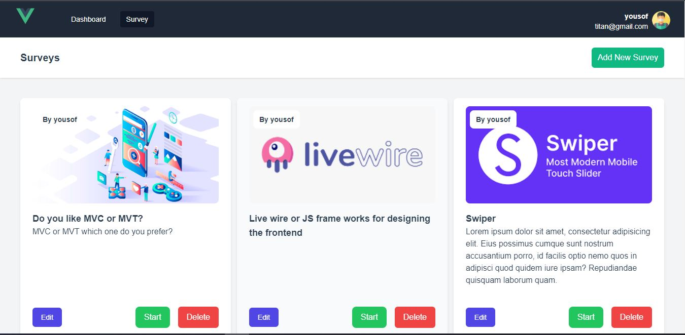
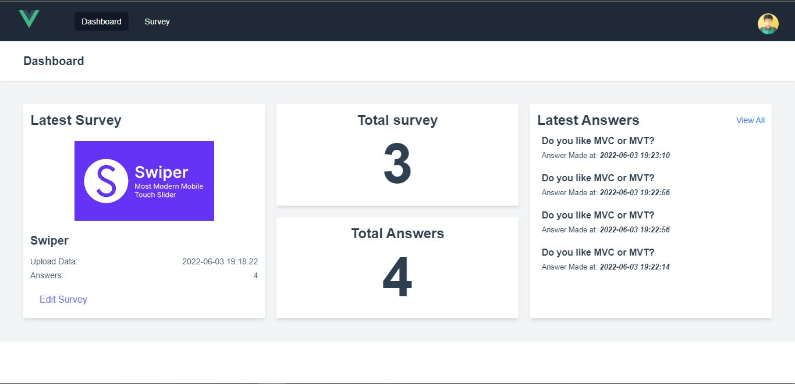

# Laravel Survey
this is a simple survey website created with laravel for the backend and Vue JS and tailwind css for the frontend.
it has been created SPA(Single Page Application) with Vue JS.

## Installation
    // to install the dependencies
    npm i
    
    
# project Images

    
    
    

